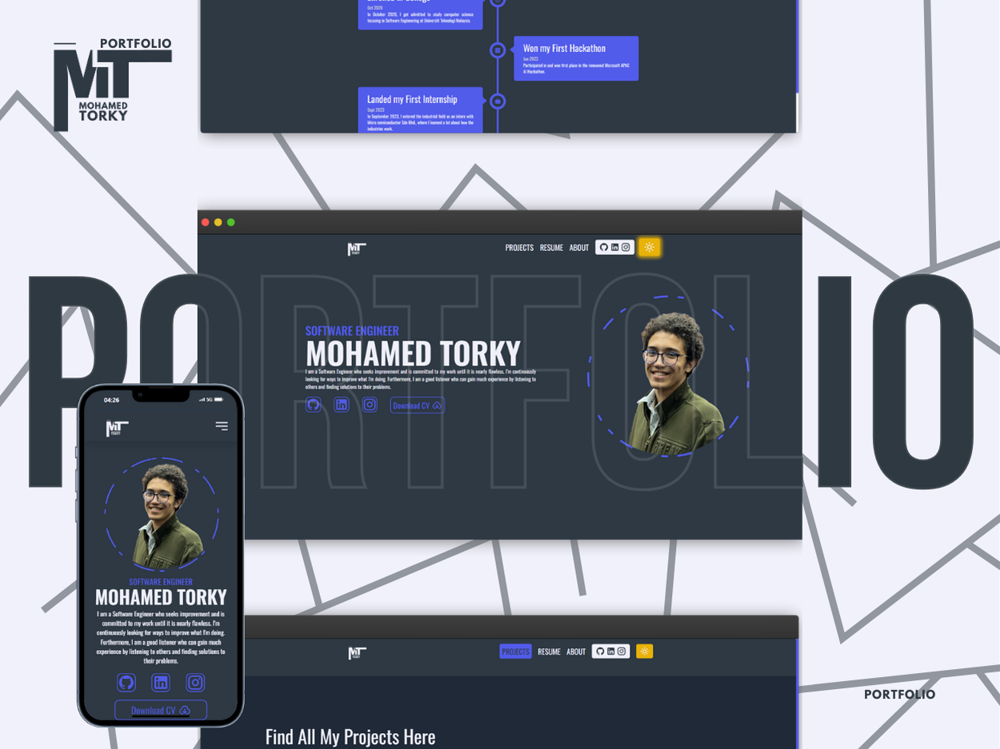

# Mohamed Torky - Portfolio

<!--  -->




## Table of Contents

- [About](#about)
- [Live Demo](#live-demo)
- [Features](#features)
- [Screenshots](#screenshots)
- [Technologies Used](#technologies-used)
- [Getting Started](#getting-started)
  - [Prerequisites](#prerequisites)
  - [Installation](#installation)
- [Usage](#usage)
- [Contributing](#contributing)
- [License](#license)
- [Contact](#contact)

## About

Welcome to my personal portfolio! I'm Mohamed Torky, a passionate software engineer specializing in building exceptional digital experiences. This portfolio showcases my projects, skills, and professional journey. Feel free to explore and get in touch!

## Live Demo

Experience the portfolio live on [https://mohamedtorky.vercel.app/](https://mohamedtorky.vercel.app/).

## Features

- **Projects**: Detailed showcases of my projects with descriptions, technologies used, and live links.
- **Skills**: A comprehensive overview of my technical skills and proficiencies.
- **Experience**: Insight into my professional background and career milestones.
- **Education**: Information about my academic qualifications and certifications.
- **Blog**: Read my latest articles on software development and technology trends.
- **Contact**: Easily reach out to me through a contact form or connect via social media.

## Screenshots

### Home Page


### Projects Section


### Contact Form


## Technologies Used

- **Frontend**:
  - [React](https://reactjs.org/)
  - [HTML5](https://developer.mozilla.org/en-US/docs/Web/HTML)
  - [CSS3](https://developer.mozilla.org/en-US/docs/Web/CSS)
  - [JavaScript](https://developer.mozilla.org/en-US/docs/Web/JavaScript)
- **Deployment**:
  - [Vercel](https://vercel.com/)
- **Version Control**:
  - [Git](https://git-scm.com/)
  - [GitHub](https://github.com/)

## Getting Started

Follow these instructions to set up the project locally.

### Prerequisites

Ensure you have the following installed:

- [Node.js](https://nodejs.org/) (v14 or later)
- [npm](https://www.npmjs.com/) or [Yarn](https://yarnpkg.com/)

### Installation

1. **Clone the repository:**

   ```bash
   git clone https://github.com/MdTorky/Portfolio.git
   ```

2. **Navigate to the project directory:**

   ```bash
   cd Portfolio
   ```

3. **Install dependencies:**

   Using npm:

   ```bash
   npm install
   ```

   Or using Yarn:

   ```bash
   yarn install
   ```

4. **Run the development server:**

   Using npm:

   ```bash
   npm start
   ```

   Or using Yarn:

   ```bash
   yarn start
   ```

5. **Open your browser and visit:**

   ```
   http://localhost:3000
   ```

## Usage

- **Explore Projects:** Browse through the projects section to see my work.
- **Read Blog Posts:** Stay updated with my latest articles on technology and software development.
- **Get in Touch:** Use the contact form to send me a message or connect via social media links provided.

## Contributing

Contributions are welcome! If you'd like to contribute to this project, please follow these steps:

1. **Fork the repository**
2. **Create a new branch**

   ```bash
   git checkout -b feature/YourFeature
   ```

3. **Make your changes**
4. **Commit your changes**

   ```bash
   git commit -m 'Add some feature'
   ```

5. **Push to the branch**

   ```bash
   git push origin feature/YourFeature
   ```

6. **Open a pull request**

Please ensure your contributions adhere to the project's [code of conduct](CODE_OF_CONDUCT.md) and [contribution guidelines](CONTRIBUTING.md) if available.

## License

This project is licensed under the [MIT License](LICENSE).

## Contact

- **Email:** [mohamed2003torky@gmail.com](mailto:mohamed2003torky@gmail.com)
- **LinkedIn:** [linkedin.com/in/mohamed-torky-243196221](https://www.linkedin.com/in/mohamed-torky-243196221/)
- **GitHub:** [@MdTorky](https://github.com/MdTorky)

Feel free to reach out for collaborations, questions, or just to say hi!

---

_Thank you for visiting my portfolio!_
